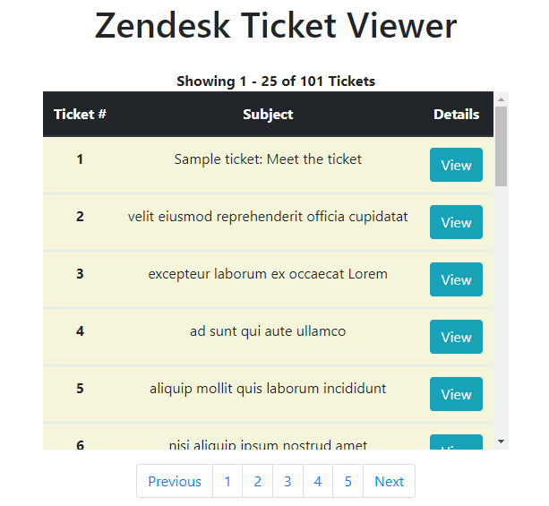
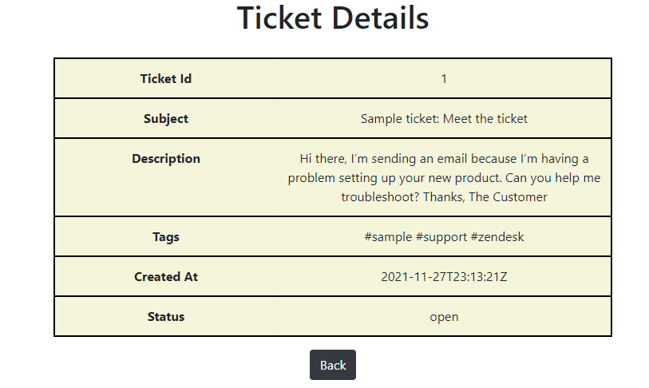

# Zendesk Ticket Viewer

The project is a ticket viewer application which 
requests tickets from the user's Zendesk account and displays 
all the tickets through pagination along with detailed view of single ticket. Also, test cases are written
to verify the application functionality


## Steps to Run
- Install Node.js from [here](https://nodejs.org/en/download/)
- Clone the repository
- Open and Navigate to the Zendesk-Ticket-Viewer Folder in a code editor
- Run the following commands step by step
 

 ```
 npm install
 -- To install the required node modules
 ```

 ```
 npm start
 -- To start the server on PORT 3000
 ```

```
 npm test
 -- To test APIs and Error handling functionalities of the application (optional)
 ```
 Navigate to localhost:3000 in the browser once server is running
## Screenshots

```
All tickets displayed in a list with pagination
```
<p align="center">
  
</p>

```
Single Ticket View
```


- Unit Testing Output
```
> zendeskticketviewer@1.0.0 test
> mocha

  When Loading Home Page
    ✔ return a page with View Tickets Button /

  Returns the first page /:pageNo (/1)
    ✔ Should return page with the first 25 tickets in paginated view (870ms)
    ✔ Should return page with the next 25 tickets in continuation with the first /2 (595ms)

  Return a view of Single Ticket /ticket/:ticketId
    ✔ Should return page containing information on single ticket /ticket/2 (375ms)

  When a page greater than the last Page is entered or random text is entered
    ✔ Should return 404 Page Not Found for /1000 (413ms)
    ✔ Should return 400 Invalid Request or API unavailable for /xxx (388ms)

  When an invalid ticket id is entered in /ticket/:ticketId
    ✔ Should return 400 Invalid Ticket Id /ticket/1000 (250ms)


  7 passing (3s)
```
## Notes
- Set user AUTH credentials in .env file
## Tech Stack
**Environment:** Node

**Frameworks:** ExpressJS, Mocha, Bootstrap

**Languages:** Embedded JavaScript


